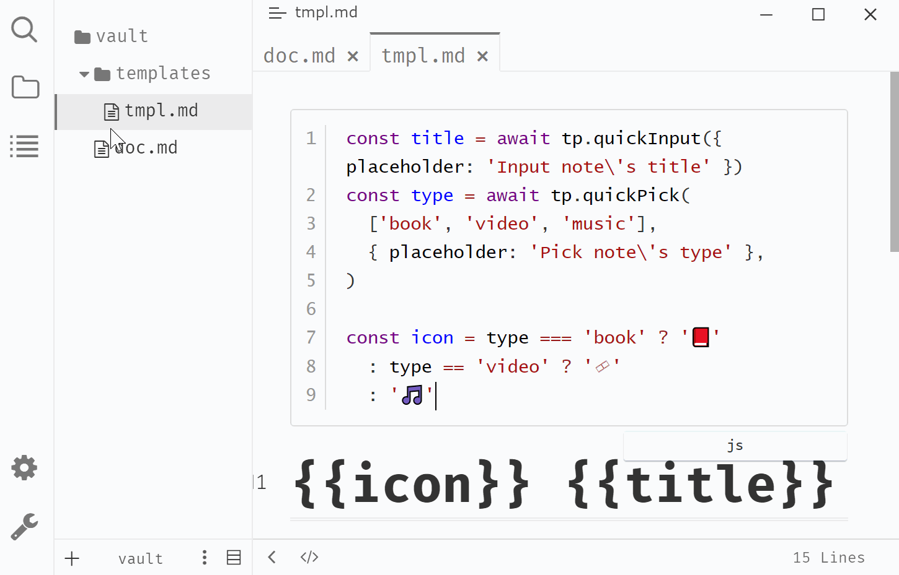
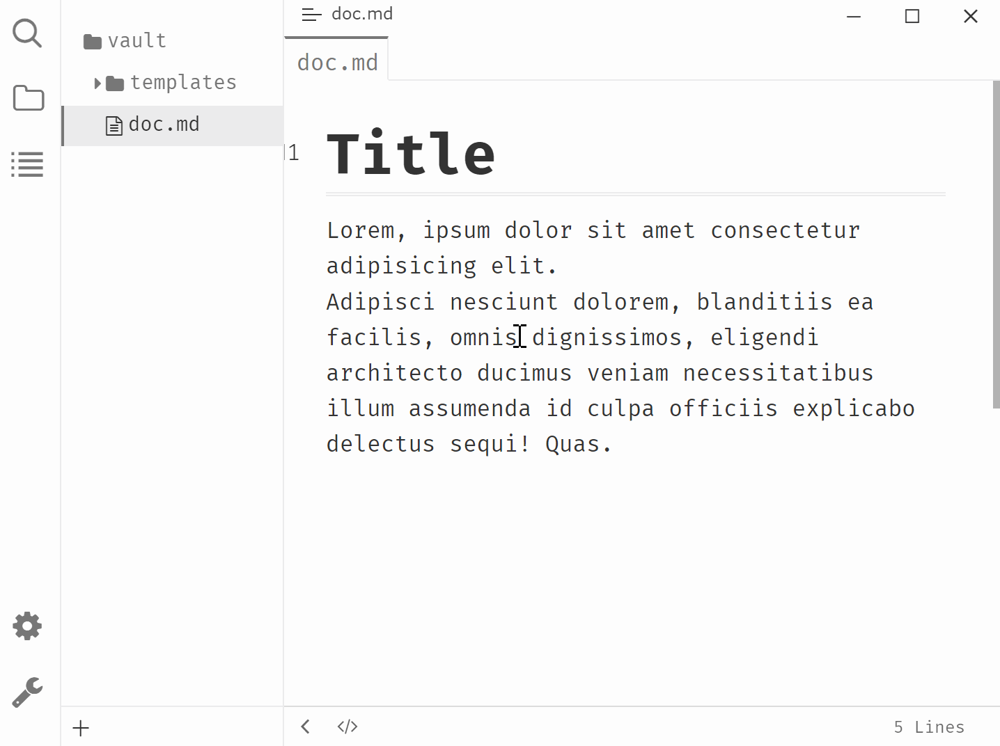

# Typora Plugin Templater

English | [简体中文](https://github.com/typora-community-plugin/typora-plugin-wikilink/blob/main/README.zh-CN.md)

This a plugin based on [typora-community-plugin](https://github.com/typora-community-plugin/typora-community-plugin) for [Typora](https://typora.io).

Create content from template:

- paste the content to current note
- create markdown file with the content

## Preview





## Example

### Paste note from template

````markdown
```js
const title = await tp.quickInput({ placeholder: 'Input note\'s title' })
const type = await tp.quickPick(
  ['book', 'video', 'music'], 
  { placeholder: 'Pick note\'s type' },
)

const icon = type === 'book' ? '📕' 
  : type == 'video' ? '🎞' 
  : '🎵'
```

# {{icon}} {{title}}
````

### Create note from template

````markdown
```js
const title = await tp.quickInput({ placeholder: 'Input note\'s title' })
const type = await tp.quickPick(
  ['book', 'video', 'music'], 
  { placeholder: 'Pick note\'s type' },
)

const icon = type === 'book' ? '📕' 
  : type == 'video' ? '🎞' 
  : '🎵'

tp.writeNoteTo(title)  // The file path will be saved, it is relative to your vault's path
```

# {{icon}} {{title}}
````

## API

global variable: `tp`

- `quickInput(options?): Promise<string>`
  - options: `{ placeholder?: string }`
- `quickPick(items: string[], options?): Promise<string | string[]>`
  - options: `{ placeholder?: string, canPickMany?: boolean }`
    > If `canPickMany` is `false`, `quickPick()` will return `string`
    > If `canPickMany` is `true`, `quickPick()` will return `string[]`
- `writeNoteTo(path: string): void`
