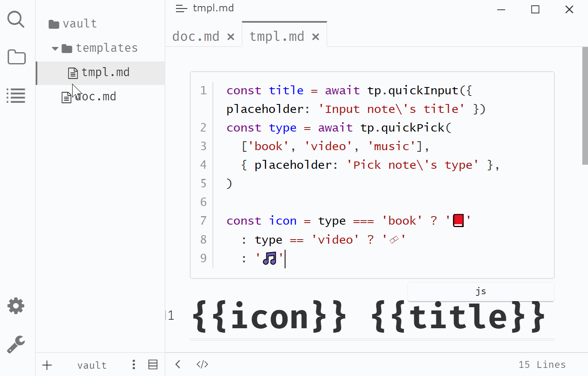
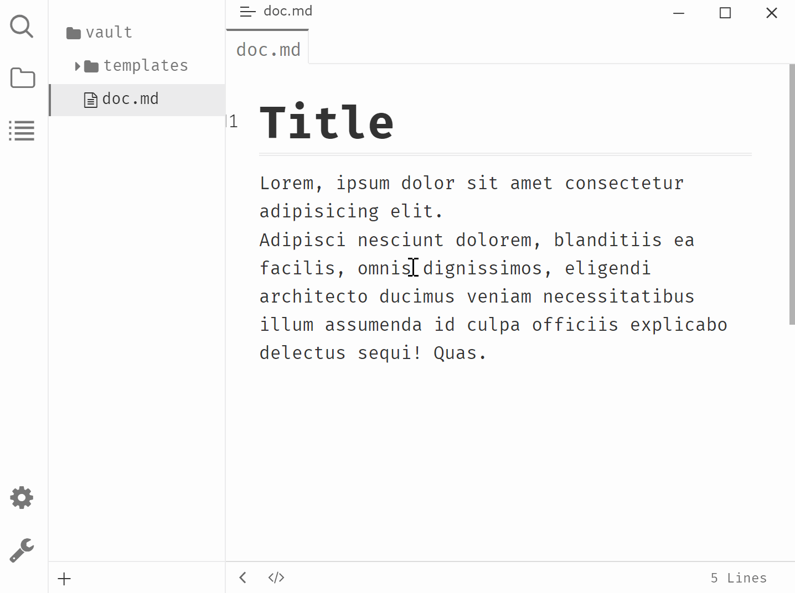

# Typora Plugin Templater

[English](https://github.com/typora-community-plugin/typora-plugin-wikilink#README.md) | 简体中文

这是一个基于 [typora-community-plugin](https://github.com/typora-community-plugin/typora-community-plugin) 开发的，适用于 [Typora](https://typora.io) 的插件。

从模板创建内容：

- 粘贴内容到当前笔记
- 根据内容创建笔记文件

## 预览





## 例子

### 从模板粘贴内容

````markdown
```js
const title = await tp.quickInput({ placeholder: 'Input note\'s title' })
const type = await tp.quickPick(
  ['book', 'video', 'music'], 
  { placeholder: 'Pick note\'s type' },
)

const icon = type === 'book' ? '📕' 
  : type == 'video' ? '🎞' 
  : '🎵'
```

# {{icon}} {{title}}
````

### 从模板创建笔记

````markdown
```js
const title = await tp.quickInput({ placeholder: 'Input note\'s title' })
const type = await tp.quickPick(
  ['book', 'video', 'music'], 
  { placeholder: 'Pick note\'s type' },
)

const icon = type === 'book' ? '📕' 
  : type == 'video' ? '🎞' 
  : '🎵'

tp.writeNoteTo(title)  // 你的笔记将要保存的文件路径，相对于笔记库根目录
```

# {{icon}} {{title}}
````
